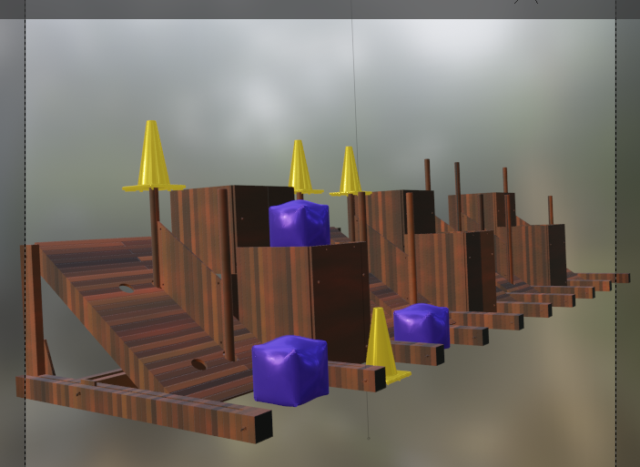

# Grid Render

A blender file with 2023 FRC Charged-Up Cones and Cubes, along with Grid.

## Why??

To create a sort-of realistic method of rendering FRC scenes for use in Computer Vision

## How can I use it?

Try to move the camera around the blender file - this will change the view of the render

Blender is kind of harsh on the computer, so you will have to wait a bit

## Implemented Features

- Somewhat realistic Cone shader
- Not-really-realistic Cube shader
  - Constant WIP for this shader
- Horrible wood material (default material)
